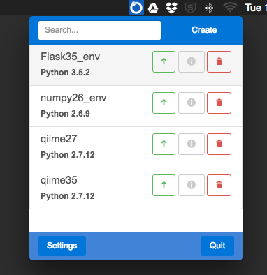

# Conda-menu
An Electron based menubar app for creating and launching Conda virtual environments.  
[](https://travis-ci.org/twbattaglia/conda-menu)  

## Installation
Download the latest version for your platform from [releases](https://github.com/twbattaglia/conda-menu/releases). Currently Conda-menu only supports macOS.

## Screenshots
  

## Requirements
To load or create any new conda environments, you must have anaconda/miniconda installed first. If you do not have anaconda installed, see https://www.continuum.io/downloads#osx to download the GUI installation or run the command below to install miniconda through the command-line.
```bash
# Download Python 3.6
curl https://repo.continuum.io/miniconda/Miniconda3-latest-MacOSX-x86_64.sh
bash Miniconda3-latest-MacOSX-x86_64.sh -b

# Download Python 2.7
curl https://repo.continuum.io/miniconda/Miniconda2-latest-MacOSX-x86_64.sh
bash Miniconda2-latest-MacOSX-x86_64.sh -b
```

## Development
```bash
# Install latest Electron (if needed)
npm install electron -g

# Download latest directory
git clone https://github.com/twbattaglia/conda-menu

# Change directory
cd conda-menu/

# Install npm packages
npm install

# start app
npm run dev
```

## Powered By
Electron: http://electron.atom.io/)  
Node.js : https://nodejs.org)  
(Continuum Analytics, Inc.) Conda AP: https://github.com/conda/conda-api  
Electron-Menubar: https://github.com/maxogden/menubar  
App Icon: Ouroboros by Silas Reeves from the Noun Project  

## Future features
- [x] validate conda installation
- [x] add option to import requirements.yaml file during new env creation  
- [ ] upload env's to anaconda
- [x] export env's to YML
- [ ] change/set default Terminal program
- [ ] add new anaconda channels
- [ ] option to open app at startup
- [ ] github auto-updates
- [ ] add homebrew installation
