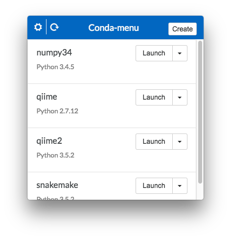

<h1 align="center">
  <br>
  </a>
  <br>
    Conda-menu
  <br>
  <br>
</h1>
<h4 align="center">An (unofficial) menubar app for creating and launching conda virtual environments.</h4>
<p align="center">
  <a href="https://travis-ci.org/twbattaglia/conda-menu"></a>
  [](https://ci.appveyor.com/project/twbattaglia/conda-menu/branch/master)
  <a href="https://github.com/twbattaglia/conda-menu/releases"></a>
</p>

## Install
Download the latest version for your platform from [releases](https://github.com/twbattaglia/conda-menu/releases). Currently **Conda-menu** only supports macOS and Windows, and is under very active development.

### macOS
1. Download the latest macOS (.DMG) in [releases.](https://github.com/twbattaglia/conda-menu/releases)  
2. Move .app to the /Applications folder
3. Run .app

### Windows
1. Download the latest (.EXE) in [releases.](https://github.com/twbattaglia/conda-menu/releases)  
3. Run .exe

## Requirements
To launch or create any new conda environments, you must have **Anaconda** or **Miniconda** installed and set as the system default Python. If you do not have **Anaconda** installed, visit https://www.continuum.io/downloads to download the GUI installer for macOS or Windows. Or for a slimmed down version, you can install Miniconda (http://conda.pydata.org/miniconda.html).  

## Screenshots
<div align="center">
  
  
  
  
</div>

## Development
```bash
# Install latest Electron
npm install electron -g

# Download latest directory
git clone https://github.com/twbattaglia/conda-menu

# Change directory
cd conda-menu/

# Install npm packages
npm install

# Start app
npm run dev
```

## Powered By
Electron: http://electron.atom.io/  
Node.js : https://nodejs.org  
Bootstrap4 : https://v4-alpha.getbootstrap.com/  
AngularJS : https://angularjs.org/  
(Continuum Analytics, Inc.) Conda API: https://github.com/conda/conda-api  
Electron-Menubar: https://github.com/maxogden/menubar  
App Icon: Ouroboros by Silas Reeves from the Noun Project  
