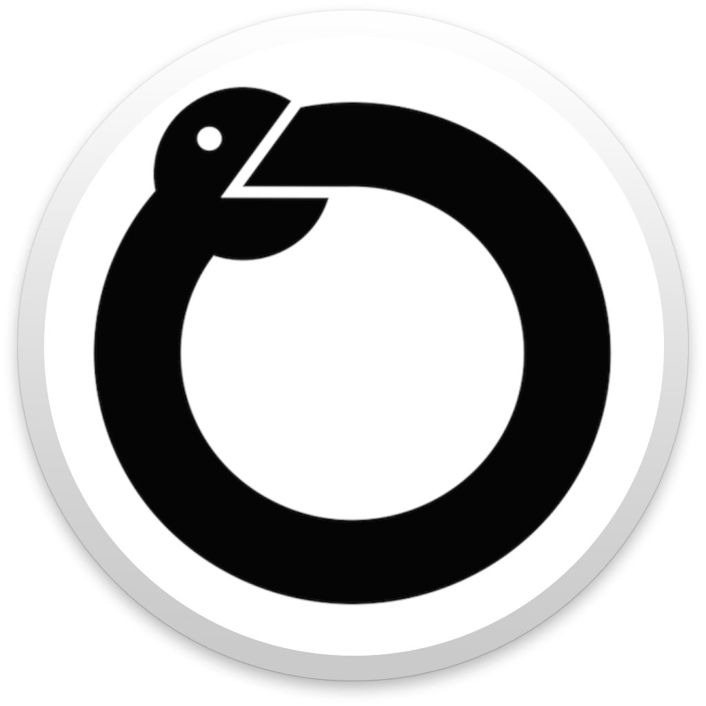
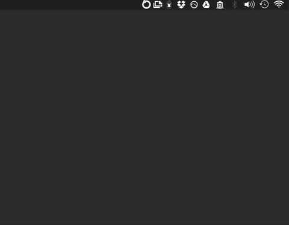

<h1 align="center">
  <br>
  </a>
  <br>
    Conda-menu
  <br>
  <br>
</h1>
<h4 align="center">An (unofficial) menubar app for creating and launching conda virtual environments.</h4>
<p align="center">
  <a href="https://travis-ci.org/twbattaglia/conda-menu"></a>
  <a href="https://github.com/twbattaglia/conda-menu/releases"></a>
</p>

## Install
Download the latest version for your platform from [releases](https://github.com/twbattaglia/conda-menu/releases).
Currently **Conda-menu** only supports macOS and Windows, and is under very active development.

### macOS
1. Download the latest version in [releases.](https://github.com/twbattaglia/conda-menu/releases)  
2. Unzip folder
3. Move .app to the /Applications folder
4. Run .app

### Windows
1. Download the latest version in [releases.](https://github.com/twbattaglia/conda-menu/releases)  
2. Unzip folder
3. Run .exe

## Screenshots
<div align="center">
  
  
  
  
  
</div>

## Requirements
To launch or create any new conda environments, you must have Anaconda or Miniconda installed and set as the system default Python. If you do not have Anaconda installed, visit https://www.continuum.io/downloads to download the GUI installer for macOS or Windows.

For a slimmed down version of Anaconda, you can install Miniconda which can be installed using the command-line on macOS.
[Download Python 3.5 for macOS](https://repo.continuum.io/miniconda/Miniconda3-latest-MacOSX-x86_64.sh)
**Note:** You must run bash Miniconda3-latest-MacOSX-x86_64.sh to install miniconda form the command line.
[Download Python 3.5 for Windows 64-bit](https://repo.continuum.io/miniconda/Miniconda3-latest-Windows-x86_64.exe)
[Download Python 3.5 for Windows 32-bit](https://repo.continuum.io/miniconda/Miniconda3-latest-Windows-x86_32.exe)

## Development
```bash
# Install latest Electron
npm install electron -g

# Download latest directory
git clone https://github.com/twbattaglia/conda-menu

# Change directory
cd conda-menu/

# Install npm packages
npm install

# Start app
npm run dev
```

## Powered By
Electron: http://electron.atom.io/  
Node.js : https://nodejs.org  
Bootstrap4 : https://v4-alpha.getbootstrap.com/  
AngularJS : https://angularjs.org/  
(Continuum Analytics, Inc.) Conda AP: https://github.com/conda/conda-api  
Electron-Menubar: https://github.com/maxogden/menubar  
App Icon: Ouroboros by Silas Reeves from the Noun Project  

## Future features
- [x] validate conda installation
- [x] add option to import requirements.yaml file during new env creation  
- [x] export env's to YML
- [x] clone env's
- [x] option to open app at startup
- [x] add support for windows
- [ ] github auto-updates
- [ ] add homebrew installation
- [ ] change/set default Terminal program
- [ ] add new anaconda channels
- [ ] add support for linux
- [ ] upload env's to anaconda
